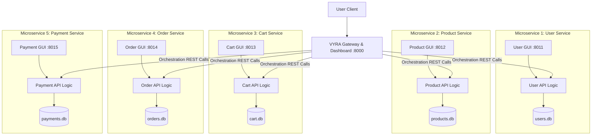

# Microservices Architecture Specification — VYRA

## Architectural Model
The Microservices Architecture decomposes VYRA into 5 completely autonomous, domain-driven services, plus a Central Gateway. Every microservice adheres strictly to the compulsory academic rule: **GUI + Business Logic + Isolated Database**.

## Database & GUI Isolation Table
| Service Name | Port | Isolated GUI Path | Isolated Database File | Managed Domain Entities |
|--------------|------|------------------|------------------------|-------------------------|
| `user-service` | 8011 | `http://localhost:8011/` | `users.db` | Users, Registration, Auth Credentials |
| `product-service` | 8012 | `http://localhost:8012/` | `products.db` | Catalogue, Categories, Inventory Stock |
| `cart-service` | 8013 | `http://localhost:8013/` | `cart.db` | Cart Items, Wishlist Items, Discounts |
| `order-service` | 8014 | `http://localhost:8014/` | `orders.db` | Orders, Order Items, Status Timeline |
| `payment-service` | 8015 | `http://localhost:8015/` | `payments.db` | Payments, Transactions, Audit Log |
