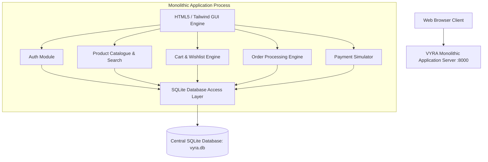

# Monolithic Architecture Specification — VYRA

## Architectural Model
The Monolithic Architecture bundles all layers of the VYRA Fashion E-Commerce application—User Interface, Application Logic, Database Access Layer, and Central Data Storage—into a single integrated execution process.

## Architectural Characteristics
1. **Single Deployable Unit**: The entire backend API and frontend assets are compiled/served together by one FastAPI process.
2. **Centralized Data Model**: All domains (`users`, `products`, `cart_items`, `wishlist`, `orders`, `order_items`, `payments`) reside within one database file (`vyra.db`).
3. **In-Memory Component Coupling**: Function calls between modules happen in-process without network latency.
4. **Scale Model**: Horizontal scaling requires scaling the entire monolith as a single unit.
