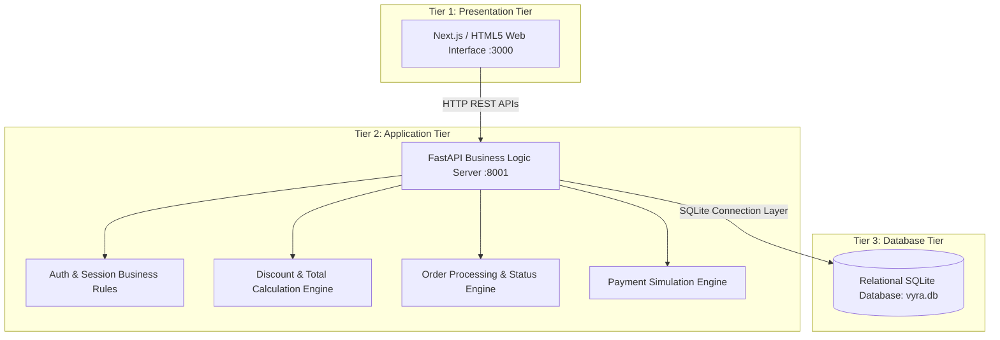

# Three-Tier Architecture Specification — VYRA

## Architectural Model
The Three-Tier Architecture physically and logically decouples the VYRA Fashion E-Commerce application into three independent tiers: **Presentation Tier (Tier 1)**, **Application Tier (Tier 2)**, and **Database Tier (Tier 3)**.

## Strict Boundary Rules
- **Presentation Tier Rules**: Must only execute UI rendering and user interactions. Zero direct file access to `vyra.db` or database queries. All data access must pass through REST API endpoints on Port 8001.
- **Application Tier Rules**: Executes business rules, discount calculations, validation, and database operations.
- **Database Tier Rules**: Manages table persistence, schema constraints, and transaction integrity.
